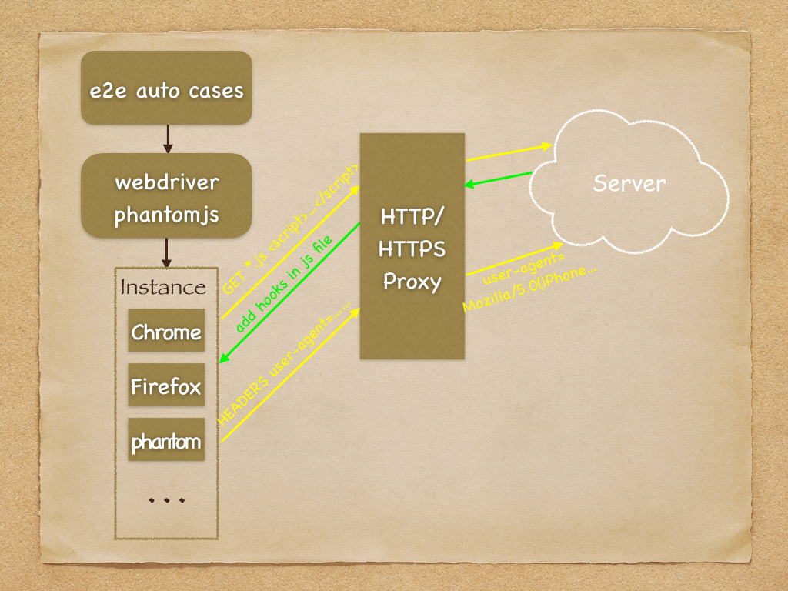
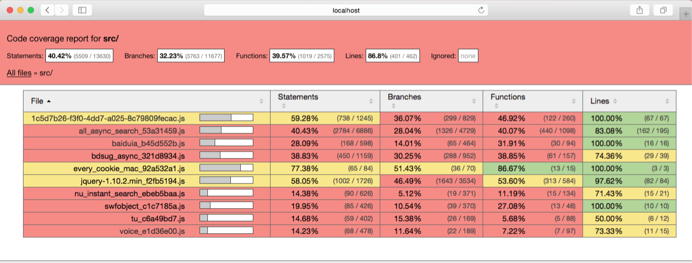
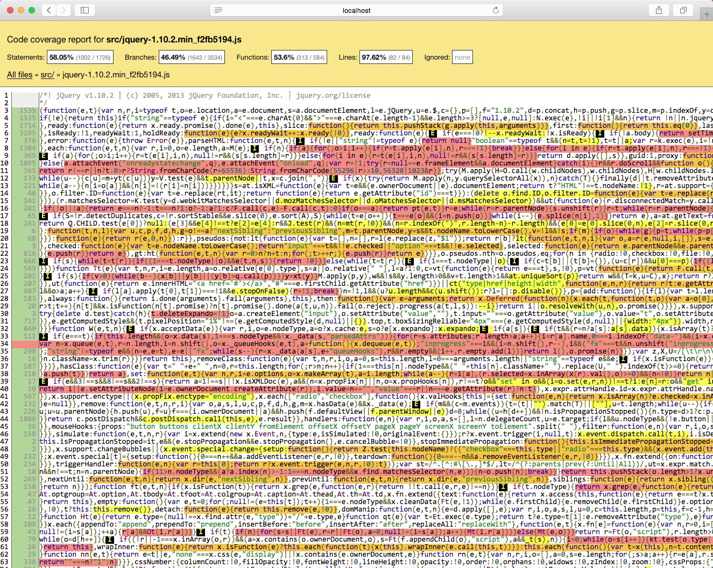
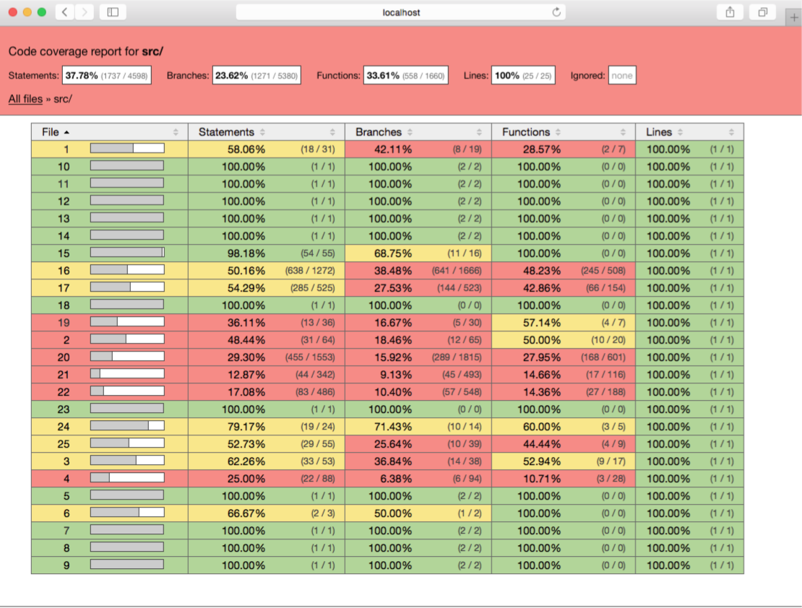

# 前端自动化测试经验介绍

## 自动化测试目的

`保证质量`和`节约成本`是做自动化测试的根基，理论上几乎全部的测试都可以进行自动化，而且都有多种自动化方案，如何选择方案以及是否要自动化就要依据这两点来看了
。

## 单元测试

### 长处
单元测试用于对代码进行函数级别的测试。从最小的执行单元进行测试覆盖，全面细致。

### 短处
处理前端的复杂交互显得无能为力且编写笨重，本身实现停留在JS和DOM层级上，截图等需求也无法实现，无法保证兼容性的UI和交互测试。
有些项目源码编写较为规范，对原生的DOM事件都有做代理，通过单测也可以实现交互上的测试，如[`ueditor`](https://github.com/fex-team/ueditor/tree/dev-1.5.0/_test)等。

### 使用建议
建议针对非交互类的底层模块进行单测质量保障，如*math.js*、*utils.js*这类。

### 常用工具&框架

[`qunit`](https://qunitjs.com/)  
[`jasmine`](http://jasmine.github.io/)  
[`mocha`](https://mochajs.org/)  

## e2e测试

### 长处
可针对功能模块进行功能测试，模拟用户操作，擅长对处理多交互进行回归保证。仔细划分又可以区分成打开真实浏览器和使用phantomjs模拟浏览器两种。打开真实浏览器还可用于兼容性测试。  
[`legend`](http://legend.baidu.com/)这个项目就是用的e2e测试。新功能更新由QA设计手测，旧功能跑e2e单测。提测完毕后由QA编写此次新功能的手测自动化case。目前这个项目仅依靠一个QA人力即可。

### 短处
e2e的测试可以看做是对手测的录制回放，需要一定的编写和维护成本。case编写的好坏决定了对质量保证的好坏。人员不足时不宜采用此方法。页面变更较大时，很多case需要重写。**由于是模拟用户操作，JS层级的代码覆盖率不好统计**。

### 使用建议
针对项目迭代时不会进行变更的功能点做e2e回归测试，会节省大量回归成本，而且比人肉更能保证质量。

### 常用工具&框架

[`Phantomjs`](http://phantomjs.org/)
[`Casperjs`](http://casperjs.org/)
[`Selenium`](http://www.seleniumhq.org/)
[`Webdriverjs`](https://github.com/SeleniumHQ/selenium/wiki/WebDriverJs)
[`Webdriverio`](http://webdriver.io/)
[`Protractor`](https://angular.github.io/protractor/#/)

## 正文

总结了上面两种通用的前端自测方法，由于前端与用户的交互直接相关，因此前端产品线应该使用e2e测试会更利于质量保障。 

### 从人力角度讲

> e2e自测时需要编写并维护case，这部分工作可以由一些具有录制回放工能的工具或平台来减轻压力，如[`fis全流程平台`](http://solar.baidu.com/ci/)

### 从质量保障角度讲

> 一般在进行手测设计时，很难保证手测case是否可以覆盖全部的前端JS逻辑，以全面的保证质量，因此e2e的自动化测试也无法保证对项目的测试覆盖是否全面。

### 一个新的需求

> e2e自测框架中支持打开真实浏览器的框架均不支持模拟手机UA，这样我们前端们经常使用的`Chrome`浏览器控制台模拟手机的开发方式基本不可用。有时我们确实有这类需求，如何解决？

下面提供一套使用[`Webdriverjs`](https://github.com/SeleniumHQ/selenium/wiki/WebDriverJs)进行e2e自动化测试，并能成功解决上面问题的方案。

## webdriver/phantom [istanbul](https://github.com/gotwarlost/istanbul)实现e2e测试的JS代码分支、语句覆盖率统计

### 原理

### 效果

#### 例子一

在没有源码的情况下，对任意url(线上或线下，只要能访问集即可)进行e2e测试后，都可以得知此次测试的覆盖率。case详见[e2e-istanbul-page](./e2e-istanbul-page)。 
如对`https://www.baidu.com`输入`tupian`并搜索进行测试后的覆盖率：

查看下百度首页对于`jquery-1.10.2.min_f2fb5194.js`的使用情况： 

#### 例子二
此外还可以使用`chrome`浏览器来模拟手机UA显示页面，case详见[e2e-istanbul-phone](./e2e-istanbul-phone)。 

对于全部JS内容都写在了html的``标签中的页面，如上图页面，也一样可以查看JS覆盖率：
